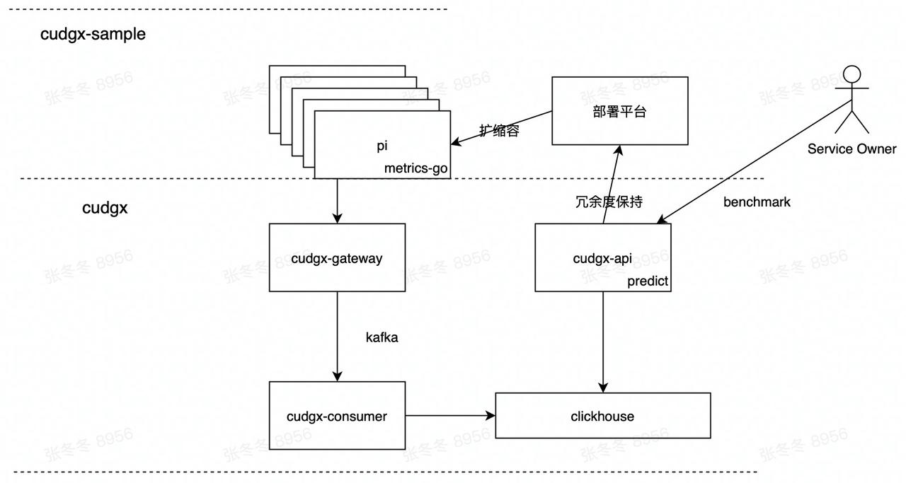

## Cudgx

`cudgx-api` 是cudgx api模块，维护自动扩缩容规则。其中predict模块可以根据扩缩容规则和打点数据计算冗余度，配合bridgx&schedulx，实现自动扩缩容。

`cudgx-gateway` 是cudgx gateway模块，负责收集`metrics-go`上报的打点数据，并将数据分发到Kafka。

`cudgx-consumer` 是cudgx consumer模块，负责消费kafka数据，存储至clickhouse。

## Cudgx-sample

`cudgx-sample-pi` 是cudgx提供的sample应用，代码层面已经嵌入了Cudgx SDK `metrics-go`，定时向gateway上报打点数据。

`cudgx-sample-benchmark` 是cudgx提供的benchmark工具，配合pi应用，实现打点信息上报。

### 数据流程

指标数据流程为： 
1. cudgx-sample-pi 调用打点SDK `metrics-go`，SDK会将用户的打点数据按照指定时间周期聚合（默认是1s）。
2. cudgx-sample-benchmark 调用pi程序模拟流量。
3. metrics-go 每个聚合周期会将指标推送到cudgx-gateway。
4. cudgx-gateway 将数据分发到Kafka。
5. cudgx-consumer 消费数据，存储到Clickhouse。
6. cudgx-gateway 基于Clickhouse查询指标，计算冗余度，配合bridgx&schedulx实现自动扩缩容。

**cudgx架构说明**

